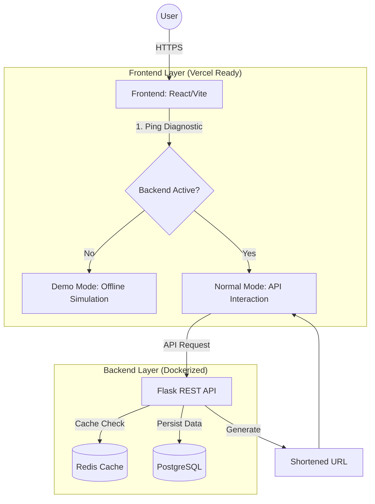

# 🏛️ ARCHITECTURAL LINKS

[](https://github.com/jasenalfatamaa/url-shortener/actions)
[](https://archlinks.vercel.app/)

**Architectural Links** is a premium, cinematic URL shortening system designed with high-performance aesthetics and monolithic structural integrity. It features a reactive 3D parallax background, a self-diagnostic demo mode, and a robust microservices-ready backend.

---

## 🏗️ System Architecture

The application is built using a modern decoupled architecture, ensuring scalability and a seamless user experience.



---

## ✨ Key Features

- **Cinematic UI/UX**: 1:1 high-fidelity design with dynamic SVG mesh grids and 3D parallax effects.
- **Auto-Diagnostic Demo Mode**: Automatically switches to client-side simulation if the backend is unreachable (perfect for Vercel-only deployments).
- **Native Social Sharing**: Integrated sharing menu via Web Share API with clipboard fallback.
- **Microservice Ready**: Fully dockerized environment with PostgreSQL and Redis.
- **CI/CD Integrated**: Automated GitHub Actions pipeline for linting and unit testing.

---

## 🛠️ Tech Stack

### Frontend
- **React 18** + **TypeScript**
- **Vite** (Build Tool)
- **Tailwind CSS** (Styling)
- **Framer Motion** (Cinematic Animations)
- **Lucide React** (Architectural Icons)
- **Vitest** (Unit Testing)

### Backend
- **Python 3.11**
- **Flask** (REST Framework)
- **SQLAlchemy** (ORM)
- **PostgreSQL** (Database)
- **Redis** (Caching & Rate Limiting)
- **Pytest** (Testing Suite)

---

## 🚀 Getting Started

### Prerequisites
- [Docker](https://www.docker.com/) & [Docker Compose](https://docs.docker.com/compose/)

### 1. Launch with Docker (Recommended)
Clone the repository and run:
```bash
docker-compose up --build
```
- **Frontend**: `http://localhost:3050`
- **Backend API**: `http://localhost:5003`

### 2. Manual Setup
If you prefer running components separately:

#### Backend:
```bash
cd backend
python -m venv venv
source venv/bin/activate # Windows: venv\Scripts\activate
pip install -r requirements.txt
python app.py
```

#### Frontend:
```bash
cd frontend
npm install
npm run dev
```

---

## 🌐 Deployment

### Vercel (Frontend Only)
The project is optimized for Vercel. Simply connect your GitHub repository to Vercel. The application will detect the absence of the backend and automatically enter **Demo Mode**.

### Production (Full Stack)
For a full deployment, use the `docker-compose.yml` configuration on a VPS with a reverse proxy like Nginx or Traefik.

---

## 📄 License
Project source is available under the [MIT License](LICENSE).

---
*Architectural Link System // v4.0.1 Stable*
